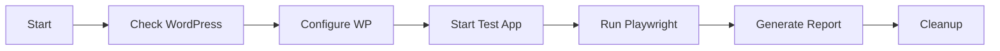
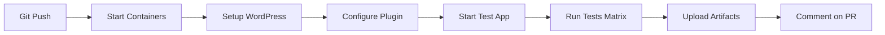

# Cookie Scenario Testing Guide

Complete guide for running automated tests both locally and in CI.

## 🚀 Quick Start

### Local Automated Tests

Run the complete automated test suite locally:

```bash
npm run test:scenarios:local
```

This will:
1. ✅ Check WordPress is accessible
2. ✅ Configure WordPress for testing
3. ✅ Start the test app
4. ✅ Run Playwright tests
5. ✅ Clean up automatically

### Manual Testing

For manual exploration and debugging:

```bash
# Start test app
npm run test:app

# Open browser
open http://localhost:5173

# Test manually using the UI
```

## 📋 Test Commands

### Local Testing

```bash
# Full automated test suite (recommended)
npm run test:scenarios:local

# Run specific scenario
npm run test:e2e:auto-detect
npm run test:e2e:cross-origin
npm run test:e2e:same-domain

# Run with UI (interactive)
npm run test:e2e:ui

# Debug mode
npm run test:e2e:debug

# View last report
npm run test:e2e:report
```

### CI/GitHub Actions

Tests run automatically on:
- ✅ Push to `main`, `develop`, `feature/cookie-scenario-testing`
- ✅ Pull requests to `main`, `develop`
- ✅ Manual workflow dispatch

**View workflow**: `.github/workflows/cookie-scenarios.yml`

## 🧪 What Gets Tested

### Test Matrix

| Scenario | SameSite | Secure | HTTPS | Expected |
|----------|----------|--------|-------|----------|
| **Auto-detect** | auto | auto | optional | ✅ Works everywhere |
| **Cross-origin** | None | true | required | ✅ Works with HTTPS |
| **Same-domain** | Lax | auto | optional | ✅ Works same-domain |
| **Strict** | Strict | true | required | ❌ Blocks cross-origin |

### Test Coverage

- ✅ Login flow (access token + HTTPOnly cookie)
- ✅ Cookie attributes (HTTPOnly, SameSite, Secure)
- ✅ CORS headers (Origin, Credentials, Methods)
- ✅ Token refresh (automatic cookie sending)
- ✅ Token verification
- ✅ Logout (cookie cleanup)
- ✅ JavaScript cookie access prevention

## 🔧 Prerequisites

### For Local Tests

1. **WordPress instance running**:
   ```bash
   # Your WordPress should be accessible at:
   https://rest-api-tests.wp.local
   ```

2. **Plugin activated**:
   ```bash
   cd /Users/juanmanuelgarrido/STUDIO/rest-api-tests
   wp plugin activate jwt-auth-pro-wp-rest-api
   ```

3. **Node dependencies installed**:
   ```bash
   npm install
   npx playwright install --with-deps chromium
   ```

### For CI Tests

All handled automatically by GitHub Actions:
- ✅ Docker containers for WordPress
- ✅ Test app setup
- ✅ Playwright installation
- ✅ Test execution
- ✅ Report generation

## 📊 Test Results

### Local Results

After running tests:

```bash
# View HTML report
npm run test:e2e:report

# Check test-results/ directory
ls test-results/

# View screenshots (on failure)
open test-results/
```

### CI Results

Results are available in:
- **GitHub Actions** tab
- **Artifacts** section (HTML reports, screenshots)
- **PR comments** (summary)

## 🐛 Debugging

### Test Failures

1. **Check test app is running**:
   ```bash
   curl http://localhost:5173
   ```

2. **Check WordPress is accessible**:
   ```bash
   curl -k https://rest-api-tests.wp.local/wp-json/jwt/v1/
   ```

3. **Check CORS configuration**:
   ```bash
   cd /Users/juanmanuelgarrido/STUDIO/rest-api-tests
   wp option get jwt_auth_pro_general_settings --format=json
   ```

4. **View WordPress logs**:
   ```bash
   tail -f /Users/juanmanuelgarrido/STUDIO/rest-api-tests/wp-content/debug.log
   ```

5. **Run in debug mode**:
   ```bash
   npm run test:e2e:debug
   ```

### Common Issues

#### Cookie not set
**Symptoms**: Test fails on cookie check

**Solutions**:
- Verify HTTPS (required for `SameSite=None`)
- Check CORS headers include `Access-Control-Allow-Credentials: true`
- Ensure WordPress plugin is active

#### Cookie not sent on refresh
**Symptoms**: Refresh endpoint returns 401

**Solutions**:
- Check `SameSite` attribute matches scenario
- Verify `credentials: 'include'` in fetch requests
- Ensure CORS origin matches exactly

#### CORS errors
**Symptoms**: Network errors, blocked requests

**Solutions**:
- Add test app URL to WordPress CORS settings:
  ```bash
  node tests/scripts/configure-scenario.js cross-origin
  ```
- Check `Access-Control-Allow-Credentials` header
- Verify no trailing slashes in origins

#### Test app won't start
**Symptoms**: Script fails at "Starting test app"

**Solutions**:
- Kill existing server on port 5173:
  ```bash
  lsof -ti:5173 | xargs kill -9
  ```
- Install http-server globally:
  ```bash
  npm install -g http-server
  ```

## 📝 Test Structure

```
tests/
├── e2e/
│   ├── cookie-scenarios.spec.js    # Main test suite
│   ├── test-matrix.config.js       # Test scenarios
│   └── helpers/
│       └── network-inspector.js    # Testing utilities
├── test-app/
│   ├── index.html                  # Test client UI
│   ├── app.js                      # Test client logic
│   └── package.json                # Server config
├── scripts/
│   ├── run-tests-local.sh          # Local test runner
│   └── configure-scenario.js       # WordPress config
└── TESTING-GUIDE.md                # This file
```

## 🔄 Test Workflow

### Local Development



### CI/GitHub Actions



## 🎯 Test Scenarios Explained

### Auto-detect (Recommended)
```javascript
// WordPress auto-configures based on request
Same-origin:  SameSite=Lax
Cross-origin: SameSite=None (with Secure on HTTPS)
```
**Use when**: You want intelligent defaults

### Cross-origin
```javascript
// Fixed configuration for cross-origin
SameSite=None, Secure=true
```
**Use when**: React app on different domain than WordPress

### Same-domain
```javascript
// Maximum security for same domain
SameSite=Lax, Secure=auto
```
**Use when**: React app served from WordPress domain

### Strict Production
```javascript
// Maximum security, blocks cross-origin
SameSite=Strict, Secure=true
```
**Use when**: Production sites, same-domain only

## 💡 Tips

1. **Run auto-detect first** - It's the most flexible scenario
2. **Check DevTools** - Application → Cookies to see actual cookie
3. **Use debug mode** - Pauses on failures for inspection
4. **Check CORS early** - Most issues are CORS-related
5. **Read the logs** - Network Activity shows all requests

## 📚 Resources

- [Test App README](test-app/README.md)
- [Cookie Testing Doc](COOKIE-TESTING.md)
- [Playwright Docs](https://playwright.dev)
- [Cookie Security Guide](../DOCS/cookie-configuration.md)

## 🆘 Getting Help

If tests fail:
1. Read error message carefully
2. Check Prerequisites section
3. Try Debugging steps
4. Review Common Issues
5. Check WordPress debug log
6. Open an issue with:
   - Test output
   - WordPress logs
   - Browser console errors
   - Configuration used
